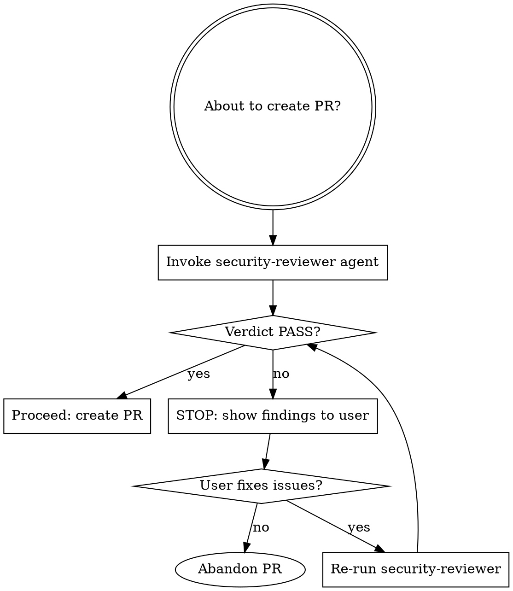

# Security Review Gate

Security review is **mandatory** before any PR is created. The PR must not be created if the verdict is FAIL.

## Process



## Rules

- **NEVER** call `gh pr create` if the security-reviewer returned FAIL
- **NEVER** skip the review because "it's a small change" or "just a refactor"
- **NEVER** proceed if the security-reviewer agent produced an error or incomplete output — treat as FAIL
- The hook will also block `gh pr create` automatically, but Claude must enforce this before even reaching the hook

## Invoking the Agent

Use the Task tool with `subagent_type: security-reviewer`:

```
Task(
  subagent_type: "security-reviewer",
  description: "Security review before PR",
  prompt: "Review the current branch for security issues before PR creation. Run git diff main...HEAD, audit all changed Go files, run go vet and golangci-lint, and return your structured verdict."
)
```

## On FAIL

Show the user the full findings table. Do not create the PR. Say:

> "Security review returned FAIL. The following issues must be resolved before this can be submitted as a PR: [findings]. Please fix these and I will re-run the review."

## On PASS

Proceed normally with `commit-push-pr` or `gh pr create`. Include "Security review: PASS" as a note in the PR description.

## Common Rationalizations — All Invalid

| Excuse | Reality |
|--------|---------|
| "It's just docs/tests" | Changed test helpers can introduce security issues. Always review. |
| "golangci-lint already runs in CI" | CI is a backstop, not a substitute for pre-PR review. |
| "The change is trivial" | Trivial changes introduced Heartbleed. No exceptions. |
| "The user said to skip review" | Only the user explicitly saying "skip security review" allows skipping — not urgency or convenience. |
| "The hook will catch it" | Claude must also enforce this. Defense in depth. |
